# FinanceMaster

**WebTech WiSe25/26 – Gruppenarbeit**

Team: Tomer Gonen, Kolja Schollmeyer

Eine Web-App zur Verwaltung von Einnahmen und Ausgaben mit Kategorisierung, Fremdwährungs-Support und Finanzübersicht.

## 🔗 Links

- **Backend Repository**: https://github.com/tomergonen2002/FinanceMaster
- **Frontend Repository**: https://github.com/KoljaSchollmeyer/frontend
- **Live Backend**: https://financemaster-8cou.onrender.com
- **Live Frontend**: https://frontend-7vbb.onrender.com
- **Lokal Frontend**: http://localhost:5173/
- **Lokal Backend**: http://localhost:8080/


## 🚀 Installation und Lokale Entwicklung

### Backend starten
Voraussetzung: Java 25 JDK installiert.

```bash
cd FinanceMaster
./gradlew bootRun
```

### Frontend starten
Voraussetzung: Node.js 20+ installiert.

```bash
cd frontend
npm install
VITE_API_URL=http://localhost:8080 npm run dev
```

## 📸 Anwendungsfälle (Use Cases)

Die folgende Dokumentation demonstriert die zentralen Funktionen der Anwendung.

### 1. Authentifizierung & Session-Management
Nutzer können ein Konto erstellen und sich anmelden. Nach dem Login gelangen sie auf das Dashboard, wo oben rechts die **Abmelden-Taste** zur Verfügung steht (sicherer Session-Logout).

<table>
  <tr>
    <td width="50%">
      <h4 align="center">Registrieren</h4>
      
    </td>
    <td width="50%">
      <h4 align="center">Anmelden</h4>
      
    </td>
  </tr>
  <tr>
    <td width="50%">
      <h4 align="center">Dashboard (mit Abmelden)</h4>
      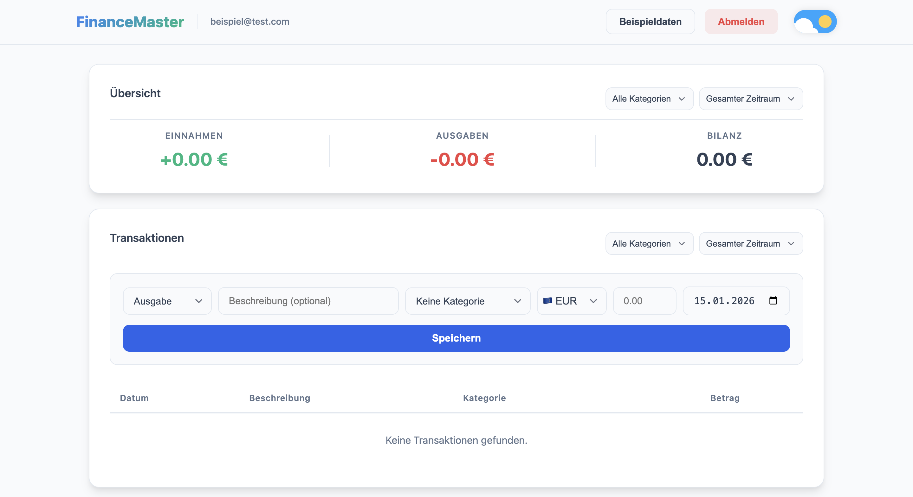
    </td>
    <td width="50%">
      <h4 align="center">Logout Request (200 OK)</h4>
      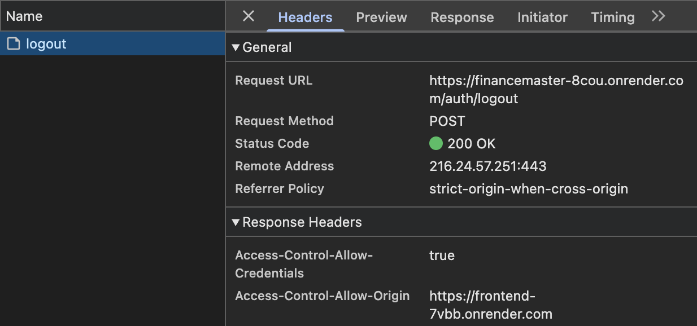
    </td>
  </tr>
</table>

### 2. Finanzübersicht
Das System berechnet automatisch die Summen aller Einnahmen und Ausgaben sowie die resultierende Bilanz basierend auf den aktuellen Daten.

<div align="center">
  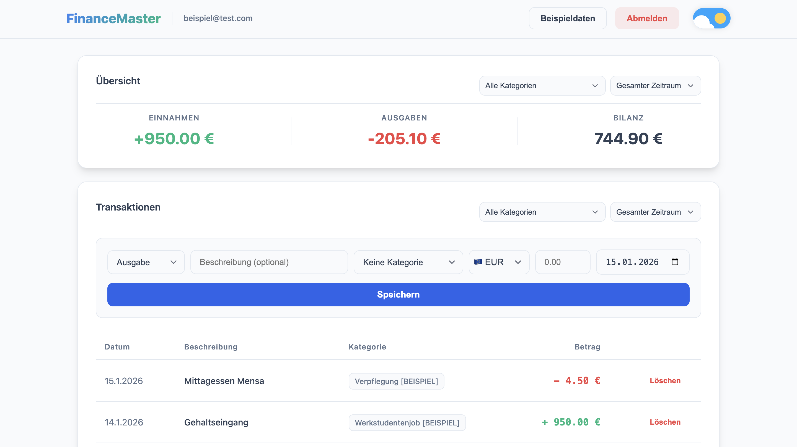
</div>

### 3. Kategorien verwalten
Nutzer können eigene Kategorien anlegen. Das System schützt die Datenintegrität: Kategorien, die bereits verwendet werden, können nicht gelöscht werden.

<table>
  <tr>
    <td width="50%">
      <h4 align="center">Kategorie-Liste</h4>
      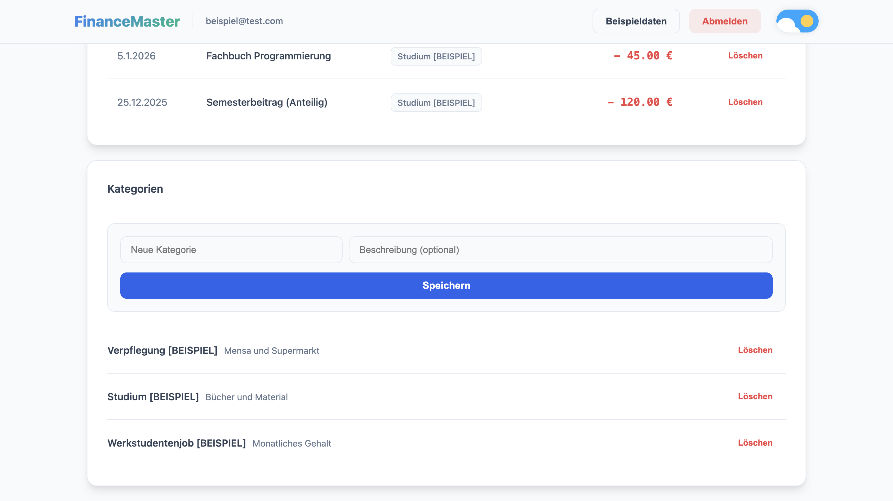
    </td>
    <td width="50%">
      <h4 align="center">Lösch-Schutz (Fehler)</h4>
      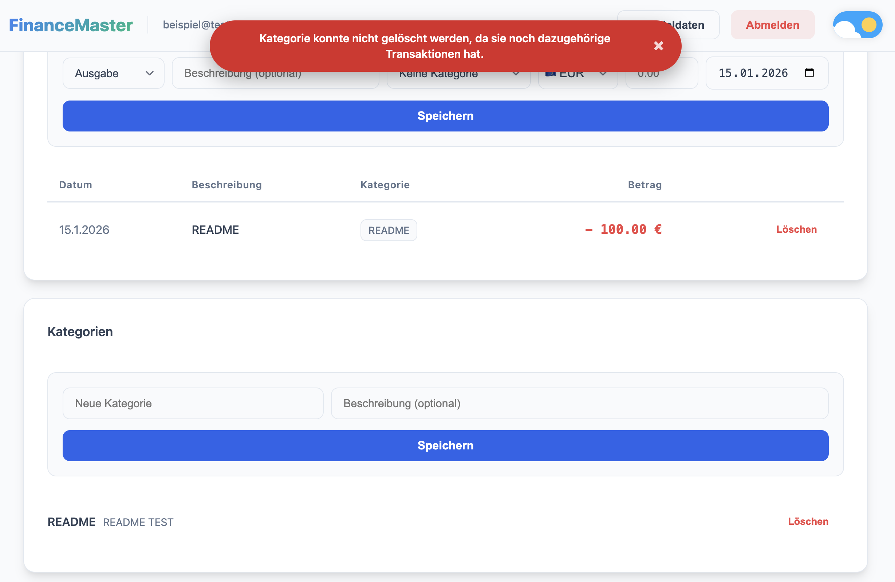
    </td>
  </tr>
</table>

### 4. Transaktionen verwalten
Robuste Erfassung von Buchungen. Das System validiert Eingaben visuell (fehlender Betrag oder Kategorie) und bestätigt erfolgreiche Einträge.

<table>
  <tr>
    <td width="50%">
      <h4 align="center">Fehler: Betrag fehlt</h4>
      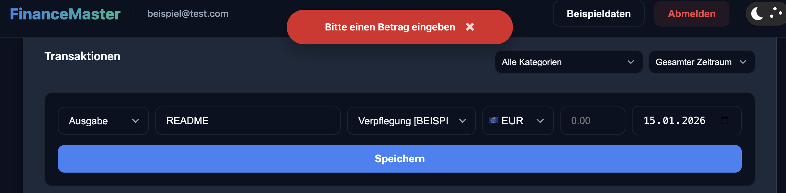
    </td>
    <td width="50%">
      <h4 align="center">Fehler: Kategorie fehlt</h4>
      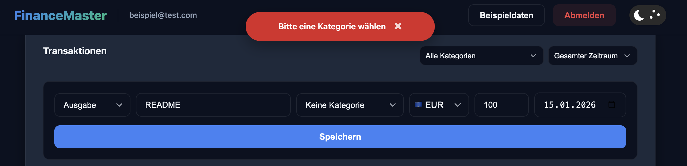
    </td>
  </tr>
</table>
<div align="center">
  <h4>Erfolgreich gespeicherte Transaktion</h4>
  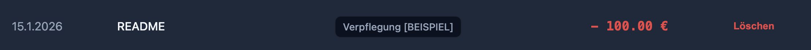
</div>

### 5. Fremdwährungen
Die App unterstützt diverse Währungen (USD, GBP, JPY, etc.) via externer API. Der Wechselkurs wird live geladen und der Euro-Wert automatisch berechnet.

<table>
  <tr>
    <td width="50%">
      <h4 align="center">Eingabe Fremdwährung</h4>
      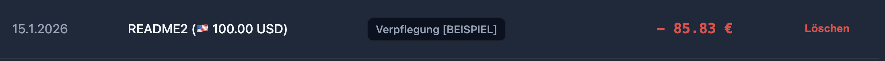
    </td>
    <td width="50%">
      <h4 align="center">Auto-Wechselkurs</h4>
      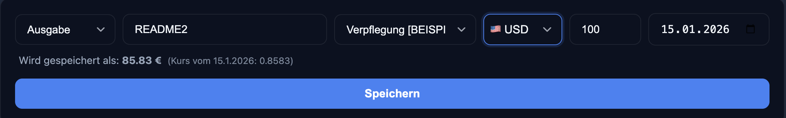
    </td>
  </tr>
</table>

### 6. Beispieldaten Generierung
Über den Button "Beispieldaten" können neue Nutzer das System sofort mit Testdaten füllen, um Funktionen wie Filterung und Bilanzierung zu testen.

<table>
  <tr>
    <td width="50%">
      <h4 align="center">Generierte Transaktionen</h4>
      
    </td>
    <td width="50%">
      <h4 align="center">Generierte Kategorien</h4>
      
    </td>
  </tr>
</table>

### 7. Filterung
Die Transaktionsliste lässt sich dynamisch nach Zeiträumen und Kategorien filtern.

<table>
  <tr>
    <td width="33%">
      <h4 align="center">Filter: Kategorie</h4>
      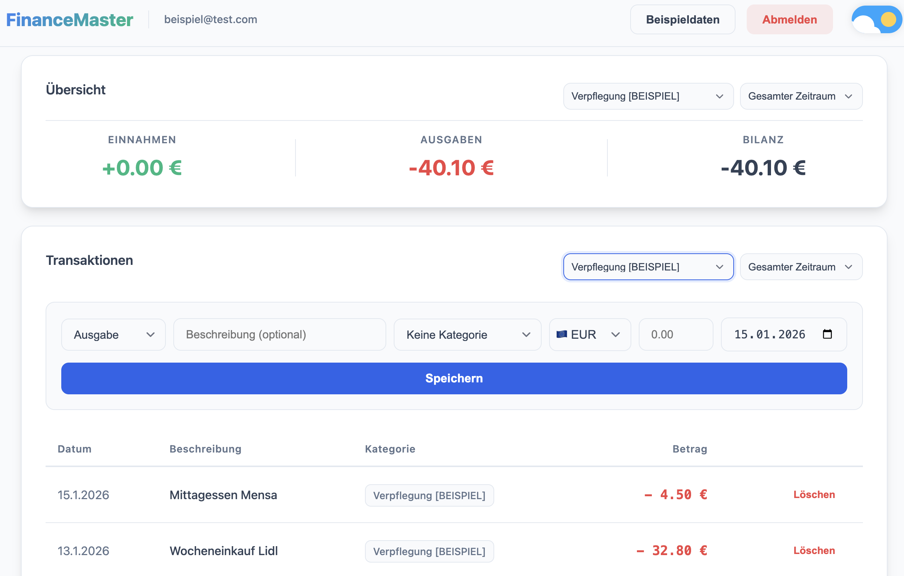
    </td>
    <td width="33%">
      <h4 align="center">Filter: Zeitraum</h4>
      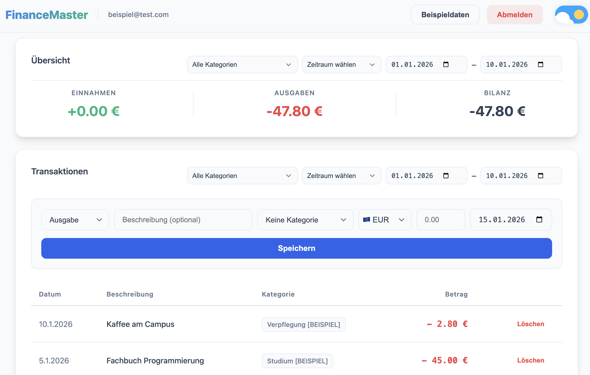
    </td>
    <td width="33%">
      <h4 align="center">Kombination</h4>
      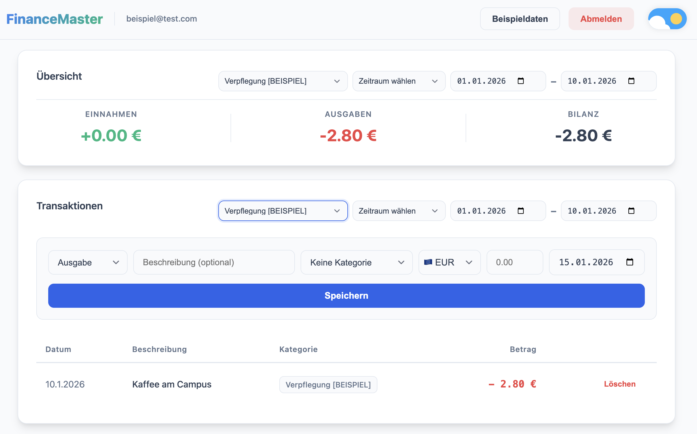
    </td>
  </tr>
</table>

### Extra: Dark Mode
<div align="center">
  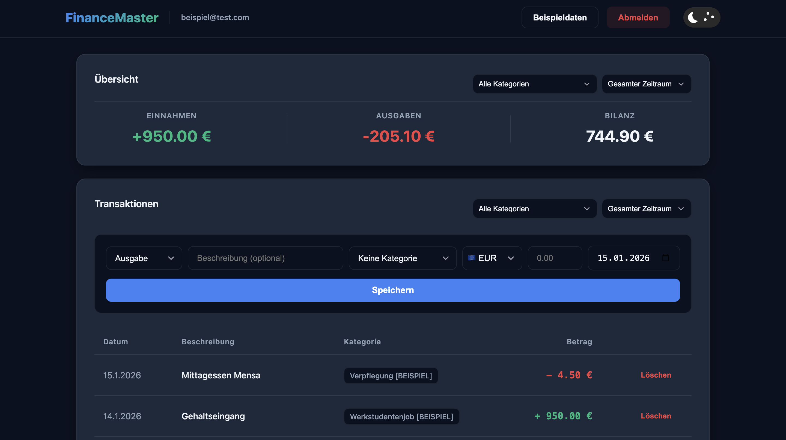
</div>

---

## 🧪 Test-Dokumentation & Qualitätssicherung

Das Projekt verfügt über eine umfassende Testabdeckung mit insgesamt **30 automatisierten Tests**.

### 1. Backend Tests (Spring Boot Integration)
Die Tests validieren die API-Endpunkte, die Datenbank-Integrität und die Sicherheitsmechanismen (Isolation).

**Ausführen:** `./gradlew test`

### 2. Frontend Tests (Vitest & Vue Test Utils)
Die Tests prüfen die UI-Logik, den State-Store (Pinia) und die API-Fehlerbehandlung.

**Ausführen:** `npm test`


## 💾 Datenbankmodell

Das relationale Modell besteht aus drei Tabellen und ihren Beziehungen:
- `users`: Benutzerkonto
- `categories`: Kategorien (gehören einem User)
- `transactions`: Buchungen (gehören User + Kategorie)

<div align="center">
  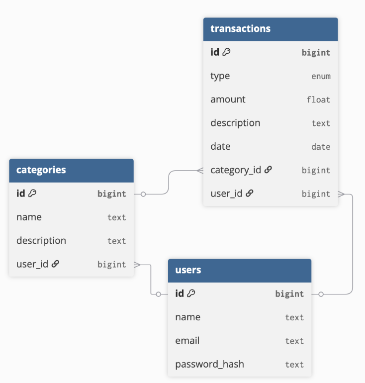
</div>

## 🛡️ Sicherheit und Architektur

### Sicherheitsmaßnahmen
- **Passwörter:** Werden sicher mit BCrypt gehasht.
- **Authentifizierung:** Session-basiert mit HttpOnly-Cookies (kein Zugriff via JavaScript möglich).
- **CORS:** Konfiguriert, um nur Anfragen vom Frontend zuzulassen.
- **User-Isolation:** Strenge Trennung der Daten. Jeder Controller prüft bei jedem Request, ob die angefragte Ressource tatsächlich dem eingeloggten User gehört.

## Nutzung mit Safari (macOS / iOS)
Safari blockiert den Login standardmäßig, da der Session-Cookie aufgrund der getrennten Domains als "Third-Party-Cookie" eingestuft wird (Intelligent Tracking Prevention).

Um die Anwendung zu testen, ist folgender Workaround nötig:
1. Öffnen Sie **Einstellungen** → **Datenschutz**.
2. Deaktivieren Sie temporär die Option **"Websiteübergreifendes Tracking verhindern"**.
3. Laden Sie die Seite neu.

### Deployment (Render)
Benötigte Umgebungsvariablen:
- `DB_NAME`, `DB_PASSWORD`, `DB_USER`
- `FRONTEND_URL` (für CORS)

### KI-Einsatz

Wir haben im Rahmen des Projekts KI-Tools wie GitHub Copilot und Gemini genutzt.
